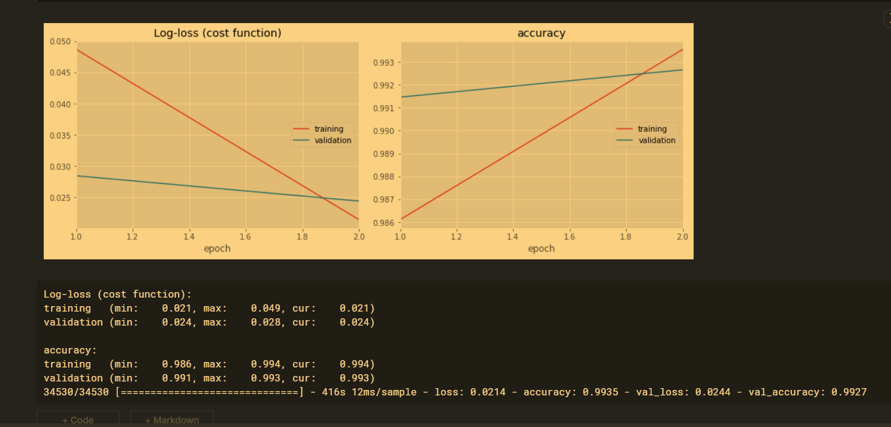

# Named-Entity-Recognition using LSTMs with Keras

A keras implementation of Bidirectional-LSTM for Named Entity Recognition.

Trained a Bidirectional LSTM Neural Network to recognize named entities in text data.


## Data Preparation (optional)

The [dataset](https://www.kaggle.com/abhinavwalia95/entity-annotated-corpus#ner_dataset.csv) is available as a single csv file.

### Technologies Used
```
1.Bidirectional LSTM

2.Keras

3.Tensorflow

4.Python
```

### Result

This was the graph we obtained after training the Neural Network.


<br>


### Author 
```
Rahul Kumar Patro
```